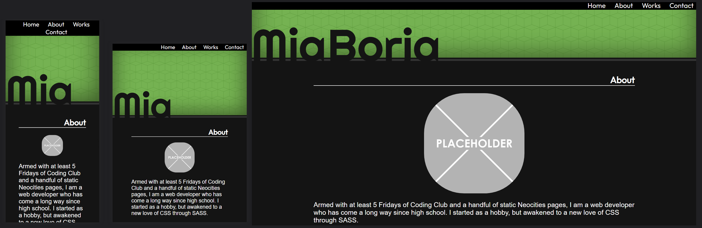
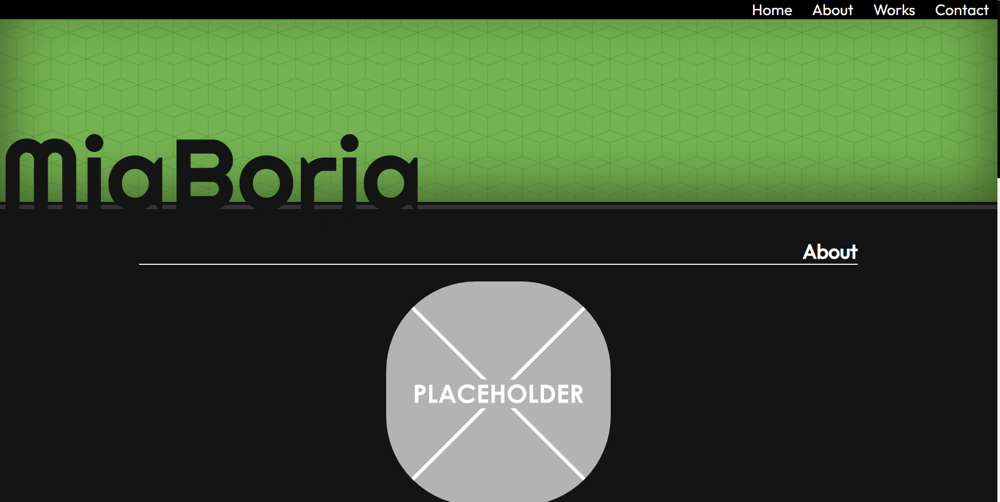

# My Portfolio v.2

## Description

[Portfolio](https://pldbrja.github.io/brjaportfolio-v2/)

This is a site that focuses on providing a portfolio template for assorted works. This is a complete overhaul of a previous version created at the beginning of the UW Bootcamp for an early assignment.

Still a linear design, the darker theme assists with lowering eye strain with a responsive layout. It can be viewed on mobile devices, and be read with a screen reader without any issues.

## Background

The original version of this site was made based solely off the image of the general idea the assignment wanted. This included a specific layout of headings for each section, but with a page devoid of any extra customization.

The current version incorporates SASS for extra control over organization both within the folder system and the CSS itself, by arranging each important subsection into several .SCSS files within a specified folder. Although the current version is static, future developments will use Javascript for enhancing the user experience.

## Screenshots

## Credits

* [SiteOrigin](https://siteorigin.com/) for their [Background Image Generator](https://bg.siteorigin.com/)

* [Graphic Placeholder](https://freesvg.org/graphic-placeholder) from FreeSVG